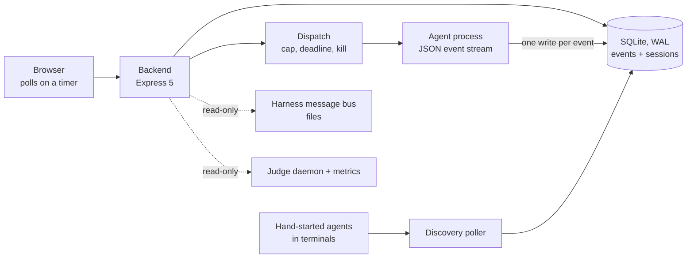

# agent-cockpit — A Web Console for a Multi-Agent System

> [!summary] TL;DR
> My agent system runs as files and terminals. agent-cockpit is one console
> over it: it lists what is running, starts headless agent runs under a
> concurrency cap, writes every event of a run to SQLite the moment it
> arrives, and after a restart marks cut-off runs as interrupted and offers
> them for resume. It reads the surrounding system — message bus, verdicts of
> the judge — and never writes it. Personal project, private repository,
> single operator.

## The problem

[[projects/claude-setup|The SDLC setup]] keeps agents and skills as files, runs
in terminal sessions and isolation in git worktrees. Operating that by hand
has real hazards: launches started too quickly overrun a shared rate limit, a
run whose session id was never captured cannot be tracked or resumed, and a
reboot loses the state of everything that was running.

## How it is built

→ [[wiki/agent-cockpit/components/dispatch|dispatch]] ·
[[wiki/agent-cockpit/components/discovery-poller|discovery poller]] ·
[[wiki/agent-cockpit/components/path-containment|path containment]] ·
[[wiki/agent-cockpit/components/quality-gate|quality gate]]

## Key decisions

- **Poll, don't push.** Every live panel is a fetch on a timer, 1.5 s for the
  active pane and 20 s for the catalog. The event table had to exist anyway,
  so a log tail is a cursor read and push would be a second mechanism. →
  [[wiki/agent-cockpit/decisions/poll-everything|decision]]
- **A launch over the cap is refused, not queued.** Counting and reserving are
  one transaction, so two clicks at the boundary cannot both pass. The slot is
  held by a provisional row that is later renamed, deleted or swept. →
  [[wiki/agent-cockpit/decisions/over-cap-reject|decision]] ·
  [[wiki/agent-cockpit/concepts/reservation-row|the reservation row]]
- **The database is the record, the process is only probed.** One write per
  stream event; at startup every run still marked running becomes
  interrupted and can be resumed by its session id. →
  [[wiki/agent-cockpit/decisions/reboot-reconciliation|decision]]
- **A repeated dispatch returns the first result.** A caller may attach a key;
  a repeat gets the first session back instead of a second agent. Unknown
  request fields are refused, not ignored. →
  [[wiki/agent-cockpit/decisions/idempotent-dispatch|decision]]
- **The surrounding system is read, never written.** The harness's bus is read
  from disk through a module that imports no write call. →
  [[wiki/agent-cockpit/decisions/substrate-read-only|decision]]
- **Verdicts come from two sources,** because the judge's daemon has the
  reasons and no history, and its metrics have the history and no reasons. →
  [[wiki/agent-cockpit/decisions/warden-verdicts-two-sources|decision]]
- **A source that is down is shown as down,** not as an empty list. →
  [[wiki/agent-cockpit/concepts/surface-never-silent|concept]]

## Quality

- **One CI job on every push and pull request, no path filter:** lint, type
  check, a forbidden-pattern gate whose rules are committed with the code, a
  "one UI framework" check, the unit suites, a visual tier.
- **Visual regression with one renderer.** Screenshot baselines belong to the
  machine that rendered them, so CI and the local pre-push hook both run the
  tier in the same pinned browser image. The hook fails closed if its own
  scope check errors.
- **Accessibility assertions** (vitest-axe) in the component tests, and a test
  that fails if the lazily loaded chart library is ever imported statically.
- **Paths from a request are resolved through every symlink** before a process
  is started in them or a file is read.

Test and baseline counts are generated from the repository:
[[wiki/agent-cockpit/inventory|inventory]]. → [[wiki/agent-cockpit/components/quality-gate|the quality gate]]

## Limits

- **The code is behind its own decisions in places.** Runs are direct children
  of the backend, not units under a service manager, so a crash of the backend
  leaves them running unwatched. The startup probe only knows runs this
  process started, so any restart marks everything interrupted.
- **The cap covers launched runs only.** Agents started by hand are discovered
  and shown, but a launch marks them interrupted before it counts. Found while
  writing the wiki and filed as a defect.
- **The bus view has no panel yet.** The backend route exists; the frontend
  does not fetch it.
- **Staleness is judged for the bus only.** An old verdict snapshot is served
  like a fresh one.
- **Coverage is reported in CI, not enforced.**
- One operator, one machine, access over a private network, no authentication
  in the app.

## Go deeper

The [[wiki/agent-cockpit/index|agent-cockpit wiki]] holds one short page per decision,
concept and component. Each cites the files it describes and the commit it was
checked against, and is flagged stale when those files change.

**Stack:** React 18, Vite 6, TanStack Query 5, Tailwind v4 with Radix
primitives, xterm.js, Recharts; Node.js 22, Express 5, better-sqlite3; Vitest,
vitest-axe, Playwright; pnpm workspaces, Forgejo Actions. Part of a self-hosted
agent platform with [[projects/claude-setup|the SDLC system]],
[[projects/agent-warden|agent-warden]] and
[[projects/agent-workorders|agent-workorders]].
