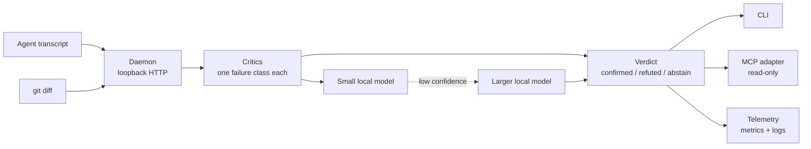

# agent-warden — Checking What Coding Agents Claim

> [!summary] TL;DR
> A coding agent reports on its own work, and "tests pass" is a claim, not a
> result. agent-warden compares such claims with artifacts the agent did not
> write — the git diff, the tool calls in the transcript — and returns
> confirmed, refuted or *could not check*. Deterministic checks run first, a
> small local model covers what they miss, a larger one is asked only when the
> first is unsure. The judge is advisory and has never been given the power to
> block anything. Personal project, private repository.

## The problem

Agents rarely lie on purpose, but they assert things the artifacts do not
support: a step marked done that was skipped, a test that asserts nothing, a
file "created" that is not in the diff. Grading those claims against the
agent's own narration is gameable — a judge that reads the reasoning can be
talked round.

## How it is built

One always-on daemon owns capture and judgment; the clients are thin.
→ [[wiki/agent-warden/components/daemon|daemon]] ·
[[wiki/agent-warden/components/critics|critics]] ·
[[wiki/agent-warden/components/mcp-surface|MCP surface]] ·
[[wiki/agent-warden/components/verdict-telemetry|telemetry]]

## Key decisions

- **Judge the artifact, never the narration.** A missing signal yields
  *abstain*, not a pass. →
  [[wiki/agent-warden/concepts/claim-evidence-verdict|claim, evidence, verdict]]
- **A local model as overseer, a human deciding.** Self-critique inside the
  worker and an overseer that acts on its own were both rejected. →
  [[wiki/agent-warden/decisions/local-llm-overseer|decision]]
- **Two tiers, both on my own hardware.** A disagreement between them forces
  human review; a failed escalation degrades to the first verdict instead of
  blocking. → [[wiki/agent-warden/decisions/two-tier-escalation|decision]]
- **One daemon, pluggable surfaces.** The project began as an editor
  extension; the evidence pipeline turned out to be the product. →
  [[wiki/agent-warden/decisions/hybrid-daemon-pluggable-surfaces|decision]]
- **The party being judged supplies the paths.** So the daemon verifies the
  file descriptor it opened, and refuses where it cannot. →
  [[wiki/agent-warden/decisions/evidence-read-hardening|decision]]
- **The CI gate reads its rules from the commit,** so two runs of one commit
  cannot be judged differently. →
  [[wiki/agent-warden/decisions/gate-reads-rules-from-commit|decision]]

## Measured, with n

| Question | Result |
|---|---|
| Finding a narrated action in prose: local model vs. regex | **7 of 9 vs. 3 of 9**, no false positive from either |
| The same nine sentences, small vs. larger model | 6 of 9 vs. 9 of 9 |
| Judging duplicate work across sessions, small vs. larger | 7 of 8 vs. 8 of 8 |
| Judging a handoff against its brief, small vs. larger | 15 of 16 for both |
| Deterministic detectors on seeded faults | 15 of 15, with 8 of 8 controls held |

The sets are small and hand-labelled, and the nine-sentence corpus was built
to defeat the regex — it measures a gap, not the system. Two runs of the small
model on those nine sentences scored seven and six.
→ [[wiki/agent-warden/concepts/measured-recall|measured recall, with its n]]

## Limits

- **Advisory only.** Nothing gates on a model's verdict; the evidence for that
  does not exist yet.
- **The decisions are ahead of the code in two places.** The editor panel is
  not a client of the daemon yet, and capture is transcripts and git — the
  planned hook and telemetry ingest is not built.
- **The verified evidence read is Linux-only.** Elsewhere the daemon refuses
  rather than read unverified.
- **Latency.** The larger model missed its first 8 s target by a wide margin;
  the target is now 40 s, taken from the measurement.
- One operator, one machine. Nothing here has been run by a team.

## Go deeper

The [[wiki/agent-warden/index|agent-warden wiki]] holds one short page per
decision, concept and component. Each cites the files it describes and the
commit it was checked against, and is flagged stale when those files change.
Counts are generated from the repository:
[[wiki/agent-warden/inventory|inventory]].

**Stack:** TypeScript, Node.js, Ollama, Model Context Protocol SDK,
OpenTelemetry, Vitest, Forgejo Actions. Part of a self-hosted agent platform
with [[projects/claude-setup|the SDLC system]] and
[[projects/agent-cockpit|agent-cockpit]].
