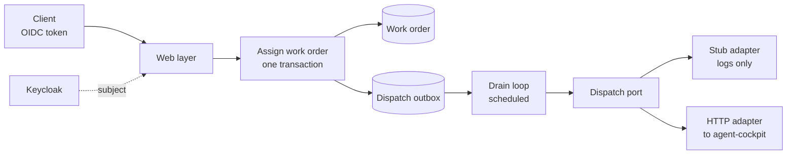

# agent-workorders — Java, Spring Boot & Domain-Driven Design

> [!summary] TL;DR
> A backend that records which agent is assigned which work order, and hands
> the order to the system that runs agents. Four modules that may name each
> other only by id, a lifecycle the aggregate enforces, and an outbox so a
> hand-over survives a crash. One Gradle command fails the build on static
> analysis, coverage, architecture rules and integration tests against a real
> PostgreSQL, and CI runs exactly that command. Personal learning project,
> private repository, in development: backend first, no frontend yet.

## Why this project

Java/Spring was my thinnest area, so I chose deliberate depth over the course
minimum. The domain is small enough to finish and rich enough to need real
modelling: a lifecycle, a rule that spans two aggregates, and delivery to an
external worker that can fail.

## How it is built

Four modules — user, agent, project, work order — each in the layers
`domain / application / infrastructure / web`.
→ [[wiki/agent-workorders/concepts/modules-by-id|modules by id]] ·
[[wiki/agent-workorders/concepts/work-order-lifecycle|lifecycle]] ·
[[wiki/agent-workorders/components/dispatch-seam|dispatch seam]] ·
[[wiki/agent-workorders/components/user-module|user module]] ·
[[wiki/agent-workorders/components/quality-gate|quality gate]]

## Key decisions

- **Modules name each other by id, and a test checks it.** A work order holds
  an agent's id, never the agent. Anything beyond that must travel along an
  edge written into an allowlist, and the graph must have no cycle. The first
  version of the rule was too wide and had to be split in a second decision. →
  [[wiki/agent-workorders/concepts/modules-by-id|concept]]
- **A rule about two aggregates is decided under a lock.** An agent may hold
  only so many orders at once. The assignment locks the agent's row, counts,
  and lets the work order decide; a test with two threads against a real
  PostgreSQL checks that one of two racing assignments loses. →
  [[wiki/agent-workorders/decisions/cross-aggregate-invariants|decision]]
- **Assigning does not call the agent.** It writes an outbox row in the same
  transaction, and a drain loop announces it afterwards. The row's id is the
  idempotency key, so a retry repeats the key of the failed attempt. The
  mechanism was held back until the receiver accepted such a key. →
  [[wiki/agent-workorders/decisions/dispatch-outbox|decision]]
- **A dispatch that cannot succeed gives up.** A refusal the adapter calls
  permanent, or an obligation older than a configured age, fails the order and
  frees the slot it held. → [[wiki/agent-workorders/decisions/dispatch-gives-up|decision]]
- **Identity is not profile data.** Keycloak owns login, email and roles; the
  application stores the token's subject and the data it owns itself. Consent
  is a timestamp, and withdrawing it erases the address in the same operation,
  with a database constraint restating the rule. →
  [[wiki/agent-workorders/decisions/consent-is-a-timestamp|decision]]
- **A work order names a project, not a path.** The project row is the one
  place that holds the directory an agent is told to work in. →
  [[wiki/agent-workorders/decisions/work-order-names-project|decision]]
- **Pull requests in a one-person repository.** Not for review: a change an
  agent proposes needs somewhere to sit between "done" and "accepted". The CI
  checks are the gate. →
  [[wiki/agent-workorders/decisions/pull-requests-single-person-repo|decision]]
- **CI judges from rules committed with the code,** so a changed rule shows up
  in the diff of the commit it judges. →
  [[wiki/agent-workorders/decisions/ci-judges-committed-artifact|decision]]

## Quality gate

- Checkstyle with zero warnings allowed, PMD and SpotBugs; JaCoCo minimums of
  85 / 80 / 85 / 85 % (instruction / branch / line / method). Each fails the
  build.
- Seven ArchUnit rules over the production classes. For the three module
  rules a second test runs them against deliberately wrong probe modules, so
  each has been seen to reject something.
- Integration tests start a PostgreSQL and a Keycloak container and fetch real
  tokens instead of forging them. CI runs the full `./gradlew check`, no fast
  subset.

→ [[wiki/agent-workorders/components/quality-gate|the quality gate]]

## Limits

- **The model is ahead of its callers.** Only 3 of the 8 lifecycle transitions
  are reached from production code; the other 5 from tests only.
- **An agent cannot be created through the API yet.** Users, work orders and
  projects have HTTP controllers, the agent module has none, so the dispatch
  path is not reachable end to end over HTTP.
- **No run against a real agent-cockpit.** The HTTP adapter is tested against
  a mock peer only.
- **Four of the seven architecture rules have no test that shows them
  failing.**
- **The tests provision their own database.** A green build says the code
  works against a container the suite started, not against a configured
  deployment.
- Delivery is at-least-once, so it is safe only with a receiver that honours
  the idempotency key.

## Go deeper

The [[wiki/agent-workorders/index|agent-workorders wiki]] holds one short page per decision,
concept and component. Each cites the files it describes and the commit it was
checked against, and is flagged stale when those files change. Counts are
generated from the repository: [[wiki/agent-workorders/inventory|inventory]].

## The deployment blueprint behind it

Before starting, I extracted the deployment layer of an earlier project
([[projects/devops-portal|Studierendenportal]]) into a reusable, language-agnostic
blueprint. Every file was classified as portable, pattern-only or discard.
agent-workorders is its first consumer and the test of whether it really is
stack-agnostic (from Node/MongoDB to Java/PostgreSQL).

- **Build once, promote by digest** — enforced in two independent places (a CI
  guard and a compose guard), not just a convention.
- **CD dry-run by default** — the whole deploy chain runs green without a server
  or secrets; only an explicit switch arms the live apply.
- Compose for two environments, Kubernetes manifests with an HPA whose silent
  failure modes are documented in the manifest itself, a local kind cluster
  with monitoring, JMeter load tests, and CI rewritten for Forgejo Actions
  (not ported line by line).

The blueprint is validated with server-side dry runs and config checks. It is a
template, not a running deployment.

## Stack

| Area | Technology |
|---|---|
| Language & framework | Java 25, Spring Boot 4.1, Gradle (Kotlin DSL) |
| Persistence | PostgreSQL, Spring Data JPA (Hibernate), Flyway |
| Security | Keycloak (OIDC resource server) |
| Quality | Checkstyle, PMD, SpotBugs, JaCoCo, ArchUnit, JUnit 5, Testcontainers |
| Delivery | Forgejo Actions, Docker Compose, Kubernetes manifests (blueprint) |
