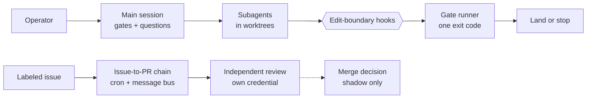

# Engineering AI-Assisted Development

> [!summary] TL;DR
> A development system I built and run for my own projects. Coding agents do
> the typing; what a reviewer would have caught is moved into checks that run
> the same way every time, and an automated decision gets authority only after
> it has been measured without it. The system is a single-operator setup on a
> self-hosted forge, and its merge step is still not autonomous.

## The problem

An agent that writes code also reports on its own work, and "tests pass" is a
claim, not a result. On a solo repository a pull request has no second reader,
so review protects nothing there. I needed quality to hold without relying on
my attention in the moment — and without trusting the agent's summary.

## How it is built

Interactive work and unattended work share the same floor: hooks on the edit
itself, and one gate runner whose exit code decides whether a change lands.

## Decisions that shaped it

- **A deterministic gate takes the reviewer's place on trunk.** Green, or the
  change does not land. → [[wiki/harness/decisions/deterministic-gate-replaces-review|decision]]
- **Who wrote a change matters, not only where it lands.** Agent-authored
  changes go behind a review gate in every repository mode.
  → [[wiki/harness/decisions/agent-changes-default-to-review|decision]]
- **Gates and questions stay in the main session;** subagents draft and
  review, one level deep. → [[wiki/harness/decisions/main-thread-orchestrates|decision]]
- **Enforcement sits at the edit, not inside one workflow,** so no entry point
  routes around it. → [[wiki/harness/components/edit-boundary-hooks|component]]
- **"Could not check" is not "passed".** The gate runner reports the two
  apart. → [[wiki/harness/components/gate-runner|component]]

## How I know it works

- **Every check is shown to fail first.** A gate nobody has watched report red
  is a hypothesis. → [[wiki/harness/concepts/verify-the-verifier|verify the verifier]]
- **Authority comes after measurement.** The merge decision runs hourly in a
  script that contains no merge call; the script that can merge is a separate
  file and is not armed. → [[wiki/harness/concepts/shadow-before-authority|shadow before authority]]
- **Review is a different process under a different credential,** so the
  reviewer is not the author. → [[wiki/harness/components/issue-to-pr-chain|issue-to-PR chain]]

The agents' own claims are checked by a separate project,
[[projects/agent-warden|agent-warden]].

## Limits

- One operator, one server. Nothing here has been run by a team.
- Merging is human. The autonomous merger is built and measured, not armed.
- Rules about *how to reason* are still prose and hold only as long as the
  agent follows them. → [[wiki/harness/decisions/judgment-rules-encoding|decision]]
- A known defect: loops that open change requests still act under the
  operator's account, which blurs who did what. It is tracked as must-fix.

## Go deeper

The [[wiki/harness/index|harness wiki]] holds one short page per decision,
concept and component. Each cites the files it describes and the commit it was
checked against, and is flagged stale when those files change. Counts — ADRs,
skills, hooks, loops — are generated from the repository:
[[wiki/harness/inventory|inventory]].
