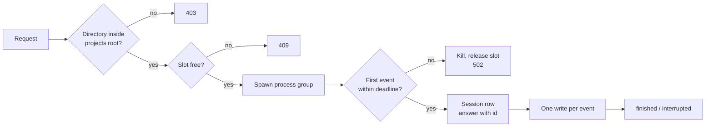

# Dispatch

> **TL;DR** — One module starts an agent run and follows it to its end. It checks the
> target directory, takes a slot, spawns the process in its own process group, and waits up
> to 10 seconds for the first event, which carries the session id. From then on each event
> is one database write. A run is killed after 30 minutes, on a write failure, and when the
> backend shuts down. [[wiki/agent-cockpit/index|↑ Wiki]]

## What it is

`dispatch()` and `resume()` in the backend. Spawn, kill, clock, id generator and database
are passed in, so the tests drive them with fakes and never start a real process; the
filesystem checks are called directly. Neither function reads the environment.

## How it works

The order of the first two checks matters: the directory is resolved before anything is
reserved or spawned ([[wiki/agent-cockpit/components/path-containment]]), and the slot is taken before the
spawn ([[wiki/agent-cockpit/concepts/reservation-row]]).

The HTTP request stays open until the first event. That is how the caller gets the
session id in the answer, and it bounds the wait: no event within the deadline kills the
process group. A new launch then leaves no row behind; a resume leaves its earlier row as
`interrupted`. A run with no id is never left running.

After capture, an exit code of 0 writes `finished` and anything else `interrupted`. A
failed write in the middle of a run kills the run and marks it interrupted; the kill
always comes before the bookkeeping, so a database fault cannot leave a process alive.

The process is started detached, which makes it the leader of its own group, and every
kill addresses the group, so tools the agent started die with it.

## What it costs / limits

- **Processes are direct children of the backend.** The ADRs speak of runs under a
  terminal multiplexer and a service manager with a timeout wrapper. The code spawns the
  agent CLI directly and keeps the timeout as a timer in the backend. If the backend dies
  without its signal handler running, the children continue with nobody watching them.
- **Every kill is SIGKILL.** The run gets no chance to flush. The events already written
  are kept, since each was its own transaction.
- **A kill that fails for a reason other than "already gone" is only logged.**
- **The launch arguments were not checked against a live CLI by the tests,** which inject
  a fake spawn; a comment marks them as the one item only a real run reveals.
- **Any unexpected launch failure is one status, 502,** with a fixed message.

## Later changes

A registry of process ids was added so that a shutdown can kill what was dispatched, and
registration was later moved to the spawn so that it also reaches a child that has not
reported its first event. See [[wiki/agent-cockpit/decisions/reboot-reconciliation]] for
what happens to a run after a restart.
