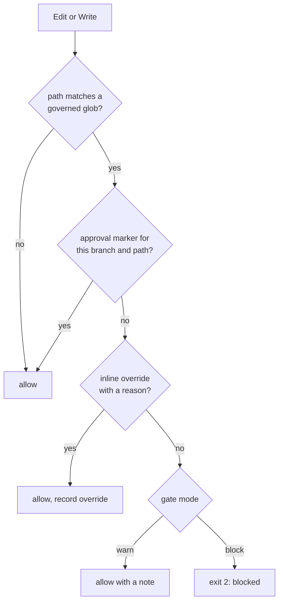

# Edit-boundary hooks

> **TL;DR** — A workflow skill that guards a file class only protects the route
> through that skill. These hooks sit on the tool call instead: an edit to a
> governed file is blocked unless it carries proof it went through the phase,
> and plan files cannot be deleted from the shell. [[wiki/harness/index|↑ Wiki]]

## What it does

The reason is in `rules/phase-gate.md`: UI fixes once shipped through a
bug-fix command and skipped the whole UI workflow, because every guardrail was
reachable from one route only. Enforcement therefore moved to the edit
boundary. Two PreToolUse hooks implement it.

## How it works

`pre-edit-phase-gate.py` holds a table of phase, globs, marker name and mode.
The marker is a file the phase's own skill writes on operator approval; its
first line names the branch and the rest name the paths approved. A marker
with no path lines authorizes nothing. `protect-plans.sh` is simpler: on a
shell call it blocks `rm`, `mv`, `shred`, `truncate` and `unlink` aimed at a
plans directory.

## Design choices

- **The mapping is data.** The UI class blocks; the migration class only
  warns, because no migration workflow exists yet to write its marker.
  Adding a class is a table row, not new hook logic.
- **Markers are per change, not per branch.** On a trunk repository the
  branch is always `main`, so a branch-only marker unblocked every later edit
  after the first approval. Keying it to the approved paths makes a new task
  need a new approval.
- **Plans stay editable but not removable.** Ticking a box must work, so only
  destructive shell verbs are blocked. Corrections are appended, which is the
  same discipline as [[wiki/harness/concepts/draft-first]].

## Limits

- Both hooks have an escape: a one-line inline override with a mandatory
  reason for the phase gate, an exemption phrase for plans. The override on a
  blocking gate is recorded, so its use can be counted, but nothing stops it.
- The plans hook matches on command text and a path substring; redirection is
  excluded on purpose, so `>` can still overwrite a plan.
- The warn-mode class enforces nothing.
