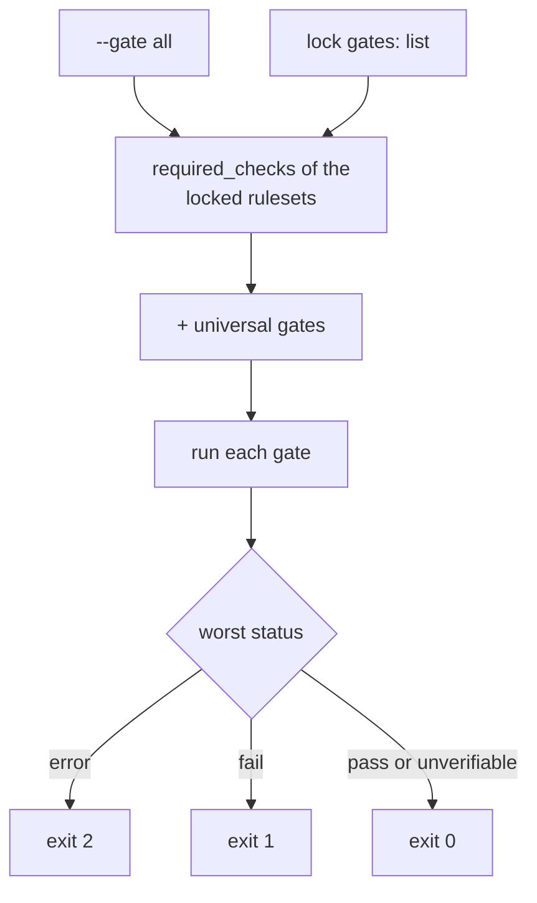

# The gate runner

> **TL;DR** — `run.py` reads a repository's lock file, works out which gates
> apply, runs each, and folds the results into one status and one exit code.
> It reports a gate that could not check as `unverifiable` rather than as a
> pass. [[wiki/harness/index|↑ Wiki]]

## What it does

`run.py --gate all` is the single entry point the pipeline's land step calls
(see [[wiki/harness/decisions/deterministic-gate-replaces-review]]). Each gate is a
separate module beside it — lint, typecheck, test, coverage, sast,
architecture, forbidden patterns, and others. The runner only selects, dispatches
and aggregates; it holds no check logic of its own.

## How it works

The gate set is the union of the lock's `gates:` list, every locked ruleset's
`required_checks`, and a short universal tuple (workflow check, command
vocabulary, forbidden patterns, reference check). An explicit `--gate <name>`
run skips the union and runs exactly that gate. Status folds by severity:
any `error` wins, then `fail`, then `unverifiable`, then `pass`.

## Design choices

- **The lock's list is a floor, not a ceiling.** It used to override the
  rulesets. Measured across six repositories, hand-written lists had gone
  stale and silently dropped gates the rulesets demanded. Union can only add,
  so a stale list gains a gate instead of losing one. A gate that arrives this
  way is named in the output as "added by union", so its first failure does
  not read as a regression.
- **Some gates belong to no stack.** "Which workflow does this repository
  use" is not a language question, so no ruleset could own it and it never
  ran. The universal tuple gives such gates a route; a stack-specific gate
  goes in a ruleset instead.
- **`unverifiable` exits 0.** A repository with no type checker would fail
  every run, and a gate that complains about every legitimate absence gets
  switched off wholesale. The cost is that a zero exit code alone does not
  prove anything was checked; the status in the output does. This is the
  instrument-side counterpart of [[wiki/harness/concepts/verify-the-verifier]].

## Limits

- Exit codes are only three-valued: `unverifiable` and `pass` are
  indistinguishable to a caller that reads the code and not the JSON.
- A repository that really must skip a required gate has to say so in the
  ruleset; there is no per-repository veto in the lock.
- Pinned ruleset versions are not enforced: a drifted pin produces a warning
  field, and the verdict comes from the live version.
