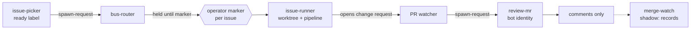

# The issue-to-PR chain

> **TL;DR** — Separate scripts pick a ready issue, run the pipeline in a
> worktree, open a pull request, and enqueue an independent review under a
> different credential. A human marker gates the code-landing stage, and the
> merge stage only records what it would do. [[wiki/harness/index|↑ Wiki]]

## What it does

Each stage is a script that talks to the next through a message bus, not
through a shared session. The stages below are the ones present in code.

## How it works

The picker only queues work from repositories on its opt-in list. The router
treats the `issue-runs` channel as irreversible and confirm-enforced, so a
request without the operator's marker is held and re-checked each cycle. The
router also caps land-capable spawns per cycle and honors a halt file. The
runner's default is a dry run; opening a change request needs `--live` plus a
confirmation variable.

## Cadence and identity

Every stage is a cron entry in one registry, and nothing is event-driven. The
router and the PR watcher run every ten minutes; the picker and the merge
shadow run hourly. A ready issue therefore reaches a review in tens of minutes
at best, and never faster than the operator sets the marker.

| Stage | Acts as |
|---|---|
| Review | a least-privilege bot token; the wrapper refuses the operator's |
| Merge executor | its own credential file; a missing key is a halt, with no fallback to a token that happens to work |
| Runner opening a change request | whatever account the forge CLI is logged in as — the runner selects no credential itself |

The last row is a known defect, not a design. The backlog tracks it as
must-fix, as one instance of a wider finding: loops that push or open change
requests do so under the operator's identity, which makes "who did this"
unanswerable from the record. The review and merge stages show the intended
pattern.

## Design choices

- **Review is a fresh process with its own credential.** The watcher enqueues
  a new session, and the review wrapper uses a least-privilege bot token
  rather than the operator's. Independence is protocol and identity together,
  as in [[wiki/harness/concepts/principal-agent-framing]].
- **Review output is reversible.** Autoposted reviews never perform the
  platform approval, so the review stage can fire without a per-run marker.
- **Merge is split into a decider and an executor.** `merge-watch` contains no
  merge call at all, so a shadow run cannot be flipped by a flag
  ([[wiki/harness/concepts/shadow-before-authority]]). `merge-exec` is a separate file that
  is inert without `--arm`.

## Limits

- The final merge is human. The executor exists but its header says nothing
  invokes it armed; this page does not claim otherwise.
- A review counts as done only when its verdict row exists, which is why a
  killed review is retried instead of silently skipped.
- Markers are one-shot and per issue, so throughput is bounded by the
  operator, by design.
