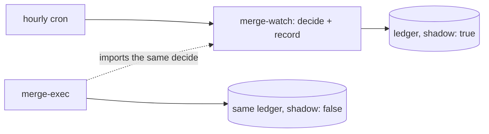

# Shadow before authority

> **TL;DR** — The autonomous merger was built as two scripts. One decides and
> records, hourly, and contains no merge call. The other can merge, and is a
> separate file. As far as the code and the ADR show, the chain is still in the
> shadow phase and unarmed.
> [[wiki/harness/index|↑ Wiki]]

## The idea

A decision procedure that will eventually act without a human first runs where
it cannot act. Its verdicts go to a ledger and are compared with what happened.
Authority is a separate, later change, read on its own.

## Where it is enforced

- **The shadow has no write path.** `merge-watch.py` says it holds no merge call
  "not behind a flag, not behind an env var". A test walks the syntax tree and
  fails if any request carries a body, a method override, or more than a URL
  positionally. Its first version grepped for the word "POST" and proved nothing
  (see [[wiki/harness/concepts/verify-the-verifier|verify the verifier]]).
- **The effector is another file.** `merge-exec.py` imports the shadow's
  predicate rather than copying it, so what decides is what was measured. It
  merges only with `--arm`, and its own header says nothing runs it that way.
  The registry lists only the shadow loop, on an hourly schedule.
- **Containment is the forge, not the code.** The merge bot is a separate
  account that sits in no branch-protection whitelist; the ADR records that
  this is what keeps it unarmed, and a proof script shows the same pull request
  refused without the whitelist entry and merged with it.

## Status, from the ADR and code

The ADR is still marked *Proposed*. The shadow loop, the effector and the
proofs are built, and the ADR describes the chain as unarmed. The live forge
setting is not visible from the repository, so "unarmed" rests on the ADR's text
and on no armed invocation appearing in the registry.

## What it costs / where it does not reach

The original arming condition, an empty stop list from the shadow corpus, turned
out to be unreachable: the corpus held no closed-unmerged pull request, because
review had made abandonment rare. The ADR replaced it with a backtest, of which
only a minority of historic cases were replayable, plus proofs with positive
controls. That is thinner evidence than the plan wanted. The stop list stays as a tripwire.

Shadow is not always the answer. A bus-routing policy engine was kept in shadow
permanently, since flipping it would let a data typo disable a guard. The
producer-axis change skipped shadow because the divergence was already known
([[wiki/harness/decisions/agent-changes-default-to-review|agent changes default to review]]).
