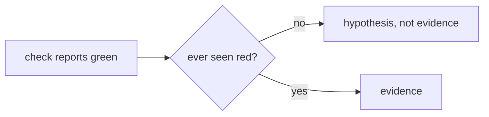

# Verify the verifier

> **TL;DR** — A green result only counts if the check could have been red. The
> rule asks for one known-bad input per check, run once, before the green is
> believed. Several guards in this repository ship with a test that does exactly
> that; nothing enforces it for the rest.
> [[wiki/harness/index|↑ Wiki]]

## The idea

The rule was promoted after three silent false-greens in one session: a baseline
that already contained the change being measured, a harness whose guard skipped
the code under test, and an exit code read from the wrong process. None was a
defect in the product. All three were in the check. The test it prescribes is
a question: *which line of the thing under test did this run exercise?* If there
is no answer, the green is unearned. "Could not check" must never render as
"passed".

## Where it is enforced

By convention in the rule, and by tests that follow it:

- **Mutation per guard.** The merge-payload test copies the script, defeats one
  guard at a time, and requires the script's self-test to fail. It also matches
  the expected failure message, because several mutations failing for the same
  accidental reason would look like several working guards.
- **A green that proved nothing.** The test that the read-only merge-watch
  script cannot write over HTTP first grepped for the word "POST" and passed.
  That proved nothing, since the standard-library request sends a POST whenever
  a body is attached. It now inspects the syntax tree, and asserts it found at
  least one request, so a test pointed at the wrong target fails.
- **The known-bad case, run once.** The phase-gate test feeds a marker
  containing only a branch name and requires it to authorize nothing.
- **Block, not just allow.** The plan-protection hook test exists because a
  regression turning a block into a silent allow reports nothing. Its allow
  cases make an "always block" regression fail too.

## What it costs / where it does not reach

Every guard needs a second artifact, the known-bad input, and that artifact
can itself be wrong; the rule has no answer to a regress. The instances above
were found by search, not by a census, and no gate fails a new check for lacking
a red test, so coverage is uneven by construction. The rule applies "when a
result is about to become a claim", so whether a given check qualifies is a
judgment call.

Related: [[wiki/harness/decisions/deterministic-gate-replaces-review|a deterministic gate replaces review]]
is the decision that makes this rule necessary, since the gate is the only
reviewer left.
