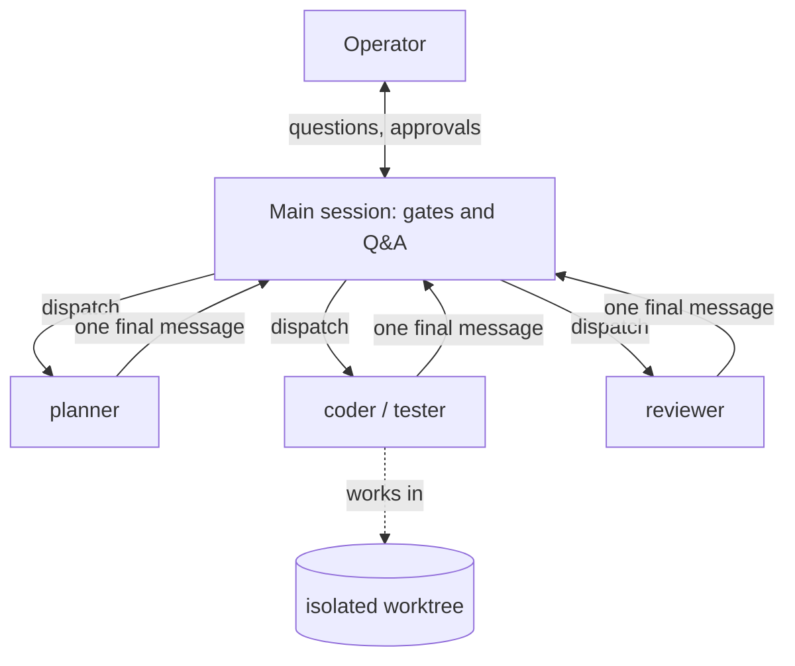

# The main thread orchestrates, subagents work

> **TL;DR** — A merge-request lifecycle fills a session with diffs and review
> prose. The rule is that the main session only asks the operator and
> dispatches; subagents do the drafting and reviewing and are discarded. A
> later ADR corrected one skill that had put an orchestrator subagent in the
> middle. [[wiki/harness/index|↑ Wiki]]

## The problem

Drafting and review inside the main thread push document bodies and diff hunks
into the context that every later turn rereads. The split also has a hard
reason: a subagent returns one final message, so it cannot stop to ask the
operator or hold an approval gate. Gates therefore have to live in the main
thread, between dispatches.

## The decision (ADR-043)

The main thread does three things: dispatch a subagent, run interactive gates
(clarifying questions, approvals, sign-off), and report. Operator Q&A counts as
deciding, not working, so it stays in main. Spec, plan and task drafting go to a
general-purpose subagent that is pointed at the stage's own skill file rather
than copy its logic. Enforcement is a `Delegation` section in each skill, not a
hook, because no runtime can reliably detect a main thread doing work itself.

## The correction (ADR-068)

ADR-043 assigned the multi-task plan runner a shape of main, then an
orchestrator subagent, then thin agents. That needs two nesting levels, and
nested spawning is off by default behind an environment flag. An autonomous run
halted on exactly that. The recorded runs had never nested either; one subagent
per task had fused all four roles.

The decision: the main thread executes the orchestrator contract itself and
dispatches the thin agents directly, one level deep, like the other pipeline
commands. The orchestrator file stays as a contract with a do-not-dispatch
banner. Flag-gated nesting and headless child sessions remain documented
fallbacks, not defaults.

## What it costs

The main thread now carries the bookkeeping of a multi-task plan. Each drafting
stage costs a dispatch even for a small document. The boundary, "does it need
the operator?", is a judgment call rather than a mechanical test.

## Later

ADR-068 amends ADR-043 and leaves it in place as the record. The
context-hygiene motive ties to [[wiki/harness/decisions/judgment-rules-encoding|where judgment rules live]]
and the dispatch chain in [[wiki/harness/components/issue-to-pr-chain|the issue-to-PR chain]].
