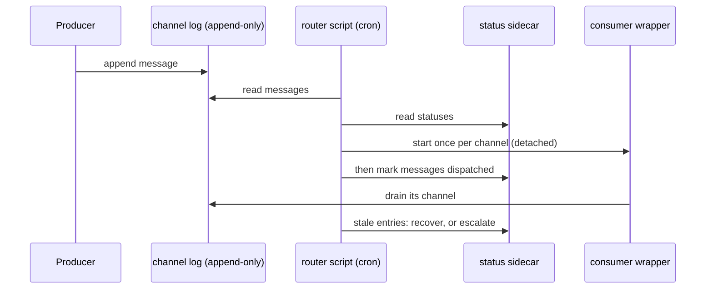

# A push router replaces per-agent polling

> **TL;DR** — Each consumer used to poll its own message channel on a slow
> cron, so latency was hours and every new channel needed a new trigger. One
> router now dispatches for all of them. The ADR described an LLM agent; what
> runs is a script, because every step is mechanical. [[wiki/harness/index|↑ Wiki]]

## The problem

Pull routing gave each agent a four-hourly trigger: up to four hours between a
failure being logged and diagnosed, one trigger per agent and channel pair, and
no way for one agent to start work in another.

## The decision

A single router is the dispatch authority. A registry maps each channel to a
consumer and to how to start it; a null entry means the operator consumes it, and
a `self` entry means the router handles the channel, which is how spawn
requests work. Per-agent pull triggers stay as a backup.

## What actually runs

The amendment records that the cloud trigger substrate the ADR assumed was
retired and the router silently stopped: nothing was scheduled. The fix kept
every duty and dropped the model. It is a script started from cron, and the
agent file states it is a contract, not a prompt, and must not be dispatched.

Dispatch fires first and records second: an earlier order left a
claim that a dispatch had happened after the circuit breaker refused it. A
fire cap bounds consumer starts per run. Entries stuck in flight past a
staleness window are recovered a bounded number of times, except on channels
marked irreversible, which are escalated and never refired. A spawn request
names a target agent and can carry a due time.

## What it costs

The router is a single point: if cron stops, nothing is pushed, and that
already happened once unnoticed. Consumers must be idempotent, since a message
can be seen as already dispatched. The coordination gate beside it ran in
shadow mode in the version I read, so the fixed guards, not the policy, were
the enforcement.

## Later

The registry has since become the source for the generated crontab (a later
ADR, schema 3). See [[wiki/harness/components/issue-to-pr-chain|the issue-to-PR chain]] for the consumers and
[[wiki/harness/concepts/shadow-before-authority|shadow before authority]] for the shadow pattern.
